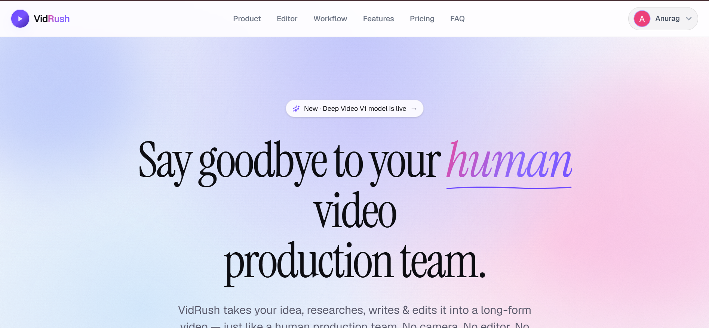

<div align="center">



# VidRush

**Turn any topic into a faceless YouTube video — automatically.**

VidRush works like a full human production team: it researches, writes, voices, and edits long-form videos from a single prompt. No camera. No editor. No script.

[](.)
[](https://react.dev)
[](https://tanstack.com)
[](https://ffmpeg.org)


</div>

---

## ✨ What is VidRush?

VidRush is an AI-powered faceless video production platform. You type a topic — VidRush handles everything else:

- 🔍 **Researches** the topic using web sources
- ✍️ **Writes** a full structured script with hooks, sections & CTAs
- 🎙️ **Voices** the script with AI narration
- 🎬 **Finds & edits** HD footage matched to each scene
- 🎵 **Adds BGM** synced to pacing and mood
- 📤 **Exports** a ready-to-upload MP4

> Built for faceless YouTube creators who want to scale content without a production team.

---

## 🖥️ Preview

> _Landing page screenshot — add `landing.png` to the root of the repo_


---

## 🚀 Tech Stack

| Layer | Technology |
|---|---|
| Framework | [TanStack Start](https://tanstack.com/start) |
| UI | React 18 + TypeScript |
| Styling | Tailwind CSS + Framer Motion |
| Routing | TanStack Router |
| Auth & DB | Supabase |
| Video Processing | FFmpeg (via WASM / server-side) |
| Deployment | Vercel |

---

## 📁 Project Structure

```
vidrush/
├── src/
│   ├── assets/              # Static images & cinematic footage
│   ├── components/
│   │   ├── landing/         # Landing page sections
│   │   │   └── sections.tsx
│   │   ├── motion/          # Animation primitives
│   │   │   ├── hero-grid.tsx
│   │   │   ├── magnetic-button.tsx
│   │   │   ├── reveal.tsx
│   │   │   ├── spotlight.tsx
│   │   │   └── tilt-card.tsx
│   │   ├── Logo.tsx
│   │   └── TopicInput.tsx
│   ├── hooks/
│   │   └── use-scroll-y.ts
│   ├── lib/
│   │   └── auth.ts          # Supabase auth context
│   └── routes/
│       └── index.tsx        # Landing page (Nav, Hero, Pricing, FAQ…)
├── public/
├── landing.png              # ← place your screenshot here
└── README.md
```

---

## ⚙️ Getting Started

### Prerequisites

- Node.js 18+
- pnpm (recommended)


### 1. Clone the repo

```bash
git clone https://github.com/yourusername/vidrush.git
cd vidrush
```

### 2. Install dependencies

```bash
pnpm install
```

### 3. Set up environment variables

Create a `.env.local` file in the root:

```env
VITE_SUPABASE_URL=your_supabase_project_url
VITE_SUPABASE_ANON_KEY=your_supabase_anon_key
```

### 4. Run the dev server

```bash
pnpm dev
```

Open [http://localhost:5173](http://localhost:5173) to see the app.

---

## 🗺️ Roadmap

- [x] Landing page with full sections
- [x] Google OAuth via Supabase
- [x] Topic input UI
- [x] Studio-grade editor mock
- [ ] AI script generation pipeline
- [ ] FFmpeg video assembly
- [ ] AI voiceover integration
- [ ] Footage search & download agent
- [ ] Export & download flow
- [ ] Pricing & billing (Stripe)
- [ ] Dashboard for render history

---

## 🧠 How It Works

```
User types a topic
       ↓
 Research Agent     →  scrapes web, finds facts & reference clips
       ↓
 Script Writer      →  builds hook, sections, CTA
       ↓
 Voice Actor        →  AI narration synced to script timing
       ↓
 Footage Curator    →  downloads & grades HD clips per section
       ↓
 FFmpeg Assembler   →  stitches clips, audio, captions & BGM
       ↓
 Export             →  MP4 ready to upload to YouTube
```

---

## 🤝 Contributing

This project is currently a work in progress. Issues and PRs are welcome once the core pipeline is stable.

1. Fork the repo
2. Create a feature branch: `git checkout -b feat/your-feature`
3. Commit your changes: `git commit -m "feat: add your feature"`
4. Push and open a PR

---

## 📄 License

MIT © VidRush AI Studios

---

<div align="center">

Built with ❤️ by [Anurag](https://github.com/Anurag13075)

</div>
